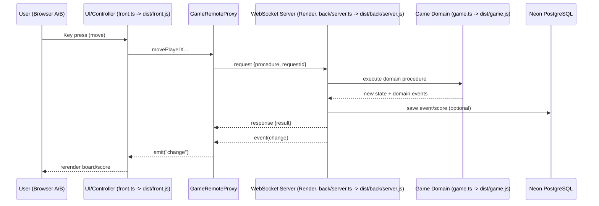
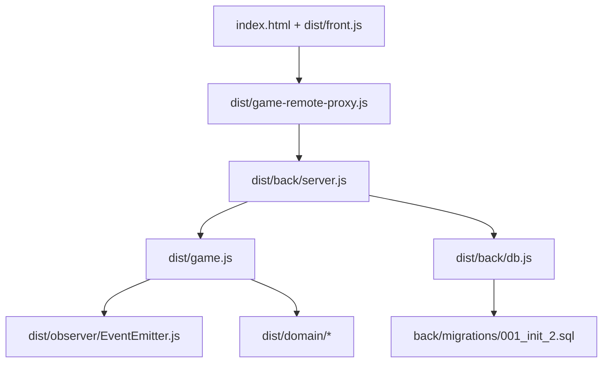
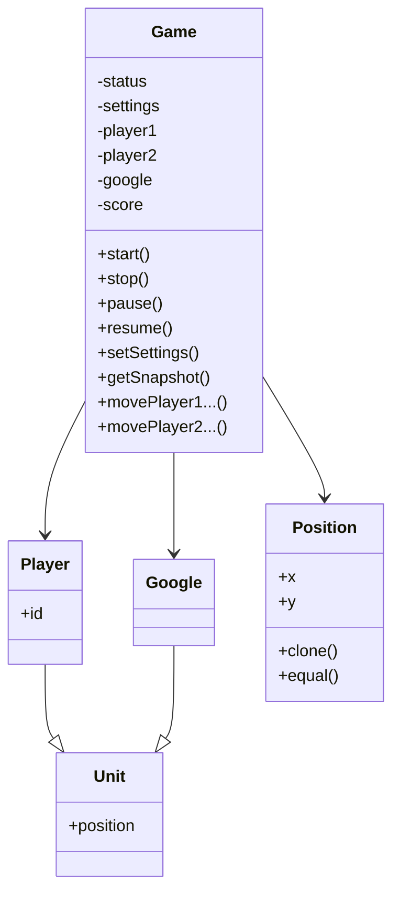
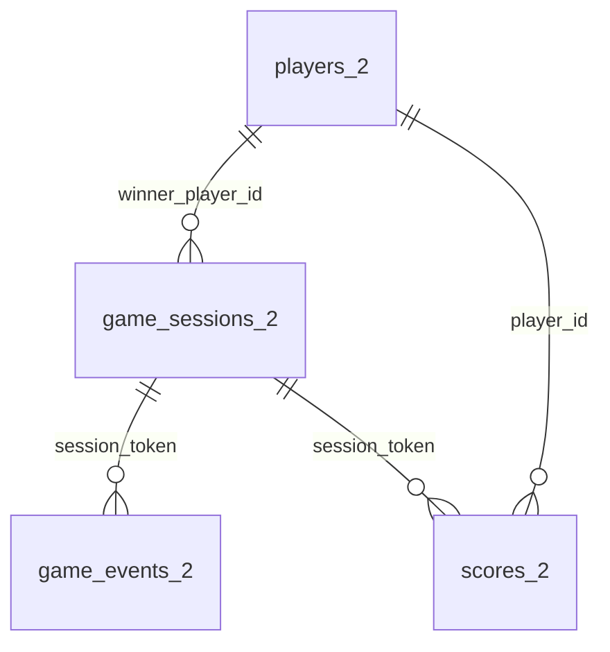
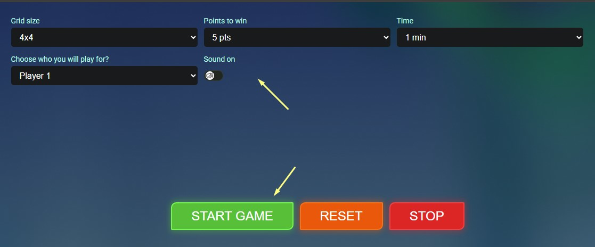
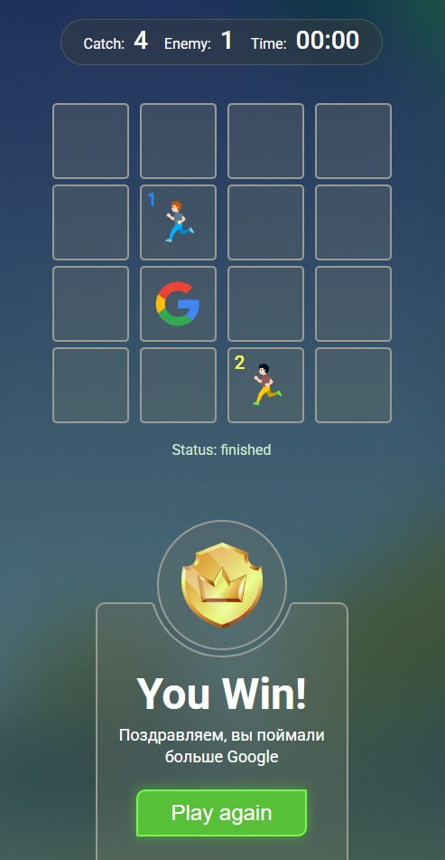
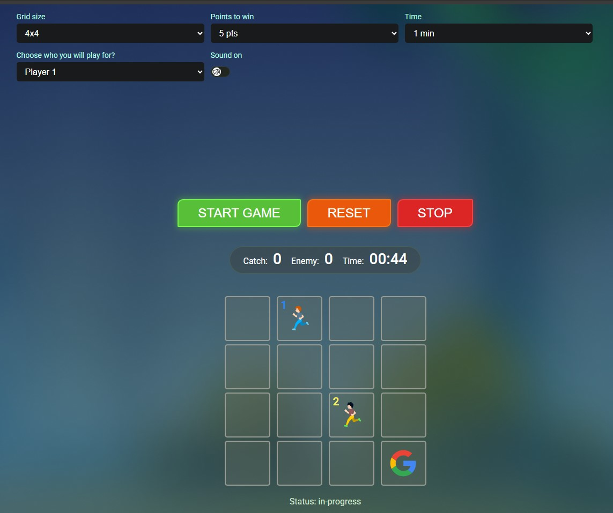

# Catch The Google

[Russian version](./README.md)

[](https://alexander0yusov.github.io/catch-the-google/)
[](https://catch-the-google-backend.onrender.com/health)
[](https://github.com/Alexander0Yusov/catch-the-google)
[](./package.json)
[](./.nvmrc)

A multiplayer “tag” game on a grid where two players try to catch a Google unit that periodically jumps to a new cell.

## Live Demo

- Frontend (GitHub Pages): https://alexander0yusov.github.io/catch-the-google/
- Backend health (Render): https://catch-the-google-backend.onrender.com/health

If your backend URL is different, update [config.js](./config.js).

## 1) Game Description, Business Logic, and Technology Rationale

### What the game does

- The board size is `columns x rows`.
- `Player 1`, `Player 2`, and `Google` are on the board at the same time.
- Players move with arrow keys (role is selected in UI).
- Players cannot move outside board borders.
- Players cannot stand on the same cell.
- If a player steps into Google’s cell, they get `+1` point.
- After a catch, Google is moved to a new valid cell.
- If Google is not caught during `googleJumpInterval`, it jumps automatically.
- Turn order is `Player 1` -> `Player 2` -> repeat.
- Delay between turns is controlled by `turnDelayMs` (default `250ms`).
- Match ends:
  - when someone reaches `pointsToWin`, or
  - when `gameDurationMs` expires.
- Win condition:
  - instant win if a player is first to reach `pointsToWin`;
  - if time is over, the player with more points wins;
  - equal score is treated as a draw.

### Key business rules in code

- Domain logic is isolated in [game.ts](./game.ts) and does not depend on DOM/browser APIs.
- Move validation:
  - board borders (`#checkBorders`),
  - target cell occupied by another player (`#checkOtherPlayer`).
- Google catch and score updates (`#checkGoogleCatching`).
- Game statuses: (`pending`, `in-progress`, `paused`, `finished`, `stopped`).
- Timers:
  - `setInterval` for Google jumps,
  - `setTimeout` for match timeout.
- Turn flow:
  - `firstTurnPlayerId=1` means Player 1 starts;
  - after a successful move, active player is switched;
  - next move is allowed only after `turnDelayMs`.

### Why these technologies

- **WebSocket (`ws`)**: real-time bidirectional channel for synchronized multiplayer state.
- **Remote Proxy**: frontend uses the same API while logic runs remotely.
- **EventEmitter (Observer)**: domain publishes events, server broadcasts them to all clients.
- **Node.js backend**: single source of truth for positions/scores/status.
- **PostgreSQL (Neon)**: stores game sessions and match events.

### Situational use of technologies

- **Observer** is used when state changes independently from a specific client (e.g. Google timer).
- **WebSocket broadcast** is used when an action in one browser must instantly appear in another.
- **Remote Proxy** is useful when UI stays thin and business logic is moved to backend.
- **Database** adds portfolio value: match history, analytics, and leaderboard-ready data.

### Data exchange flow



---

## 2) Technology Stack

- **Frontend**: HTML, CSS, TypeScript (source `.ts`) + build output in `dist/*.js`
- **Backend**: Node.js runtime + TypeScript source files
- **Realtime**: `ws` (WebSocket)
- **Architecture patterns**: lightweight MVC, Observer, Remote Proxy
- **Database**: PostgreSQL (Neon), `pg`
- **Code quality**: ESLint (TS + JS)
- **Testing**: `Vitest` (unit/integration/e2e), `ws` (e2e client)
- **Audio**: HTMLAudioElement + Web Audio fallback (`get-low.mp3`, low volume, via `Sound on`)
- **Backend deploy**: Render
- **Frontend deploy**: GitHub Pages

---

## 3) Project Structure, Dependencies, and DB

### Project folders

```text
CatchTheGoogle/
  assets/
    audio/
      README.txt
  back/
    migrations/
      001_init_2.sql
    db.ts
    server.ts
  css/
    common.css
    null.css
    style.css
  dist/
    back/
      db.js
      server.js
    domain/
      Google.js
      NumberUtil.js
      Player.js
      Position.js
      Unit.js
    observer/
      EventEmitter.js
    front.js
    game-remote-proxy.js
    game.js
  docs/
    api/
      asyncapi.yaml
      openapi.yaml
    screenshots/
      .gitkeep
      gameplay-start.png
      gameplay-win.png
      gameplay.png
  domain/
    Google.ts
    NumberUtil.ts
    Player.ts
    Position.ts
    Unit.ts
  img/
  js/
    script.js
  observer/
    EventEmitter.ts
  scripts/
    check-migrations.mjs
  tests/
    e2e/
    integration/
    unit/
  config.js
  front.ts
  game-remote-proxy.ts
  game.ts
  index.html
  package.json
  render.yaml
  README.md
  README.en.md
  tsconfig.json
  vitest.config.ts
```

### Module dependency graph



### Domain class dependencies



### DB structure and relations

All table names use `_2` suffix.

- `players_2` — player directory table
- `game_sessions_2` — match sessions
- `game_events_2` — event stream inside a session
- `scores_2` — current player scores in a session



---

## 4) Frontend ↔ Backend Flow

Game communication is fully **WebSocket-based**. HTTP is used for health-check only.

### HTTP (minimal)

| Step | Method/Path | Sender | Body | Response |
|---|---|---|---|---|
| 1 | `GET /health` | Render health-check / browser | none | `{ ok: true, service: "catch-the-google-backend" }` |

### WebSocket (main protocol)

| Order | Channel | From -> To | Message | Server action | Response |
|---|---|---|---|---|---|
| 1 | WS connect | Front -> Back | handshake | register connection | `event(change)` with current snapshot |
| 2 | request | Front -> Back | `{ type: "request", requestId, procedure: "joinGame", payload }` | assign player role | `response { result: { playerId } }` |
| 3 | request | Front -> Back | `procedure: "setSettings"` | update match settings | `response { result: snapshot }` |
| 4 | request | Front -> Back | `procedure: "start"` | create units, start timers | `response { result: snapshot }` |
| 5 | request | Front -> Back | `procedure: "movePlayer..."` | validate move and update state | `response { result: snapshot }` |
| 6 | event | Back -> Front(all) | `{ type: "event", eventName: "change", data }` | broadcast updates to all clients | UI rerenders board/score |
| 7 | event | Back -> Front(all) | `eventName: "googleCaught"/"finished"` | domain event broadcast | UI shows result/modal |
| 8 | request | Front -> Back | `procedure: "stop"` | stop match | `response { result: snapshot }` |

Protocol docs:
- HTTP docs UI: `GET /api-docs` (Render: https://catch-the-google-backend.onrender.com/api-docs)
- WebSocket docs UI: `GET /ws-docs` (Render: https://catch-the-google-backend.onrender.com/ws-docs)
- HTTP/OpenAPI spec: [openapi.yaml](./docs/api/openapi.yaml)
- WebSocket/AsyncAPI spec: [asyncapi.yaml](./docs/api/asyncapi.yaml)

---

## 5) Development and Testing

### Local run (dev)

- Install dependencies: `npm install`
- Build TypeScript into `dist`: `npm run build`
- Start backend (WebSocket + HTTP): `npm run start:back`
- Start frontend (static server): `npm run start:front`

In local development, use two terminals:
1. `npm run start:back`
2. `npm run start:front`

### How to run

```bash
npm run build
npm test
npm run test:unit
npm run test:integration
npm run test:e2e
```

### Test suites and cases

- `Unit`:
  - `Position.clone/equal` — coordinate copy and comparison correctness.
  - `EventEmitter` — event delivery and unsubscribe behavior.
- `Integration`:
  - `Game.start` — unit initialization and unique positions.
  - Turn order + `turnDelayMs` — early/wrong-player move blocking.
- `E2E` (real WebSocket server + client):
  - Match start via request/response protocol.
  - Role assignment for two clients (`Player 1` and `Player 2`).

Test execution note:
- You do not need to manually run backend/frontend for `Vitest`.
- E2E tests start a test server programmatically inside the test process.

## 6) Linting and ESLint Rules

### Commands

```bash
npm run lint
npm run lint:fix
npm run check:migrations
```

### Key rules and purpose

| Rule | Why |
|---|---|
| `eqeqeq` | prevents implicit type coercion in critical game logic |
| `@typescript-eslint/no-unused-vars` | removes dead code and unused parameters |
| `import/order` | keeps imports stable for easier diffs/reviews |
| `@typescript-eslint/consistent-type-imports` | makes TS imports predictable and cleaner |
| `no-console` = off (intentional) | server logs are required for deploy/WS diagnostics |

---

## 7) Why GitHub Pages + Render and How to Deploy

### Why this deployment setup

- **GitHub Pages** is a good fit for static frontend: simple, free, portfolio-friendly.
- **Render** is suitable for a long-running backend process with WebSocket and health-check.
- **Neon** provides managed PostgreSQL without running your own DB server.

### Quick guide

#### Backend (Render)

1. In Render: `New + -> Blueprint`.
2. Select this repository.
3. Render reads [render.yaml](./render.yaml).
4. Add Neon connection in env:
   - either `DATABASE_URL`
   - or `POSTGRES_HOST`, `POSTGRES_PORT`, `POSTGRES_USER`, `POSTGRES_PASSWORD`, `POSTGRES_DATABASE`
5. Keep `AUTO_RUN_MIGRATIONS=false` (default) to avoid changing existing tables.
6. Verify `https://<service>.onrender.com/health`.

#### Frontend (GitHub Pages)

1. Set backend URL in [config.js](./config.js):

```js
window.GAME_WS_URL = "wss://<your-render-service>.onrender.com";
```

2. Push changes to `main`.
3. GitHub: `Settings -> Pages -> Deploy from branch`.
4. Branch: `main`, folder: `/ (root)`.

---

## 8) Screenshots

### Gameplay start



### Gameplay win state



### Gameplay (main)


