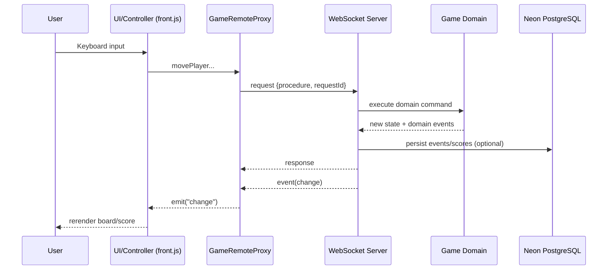
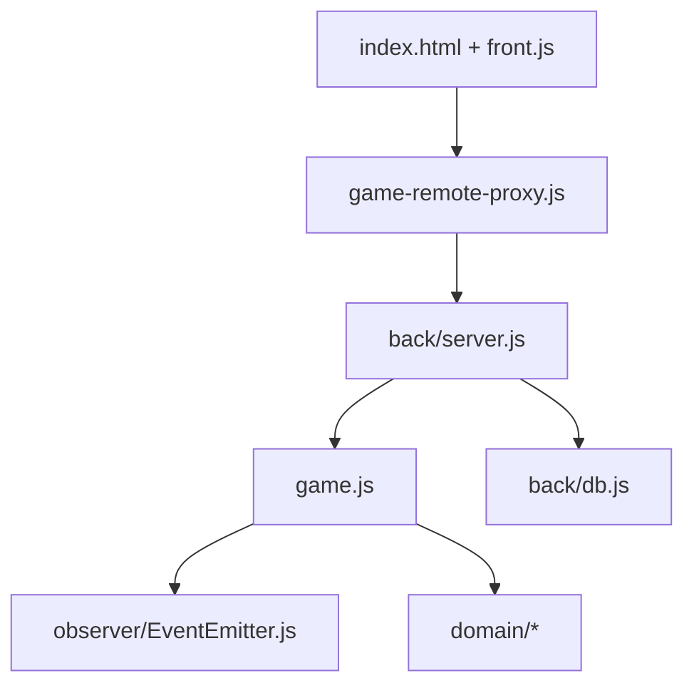
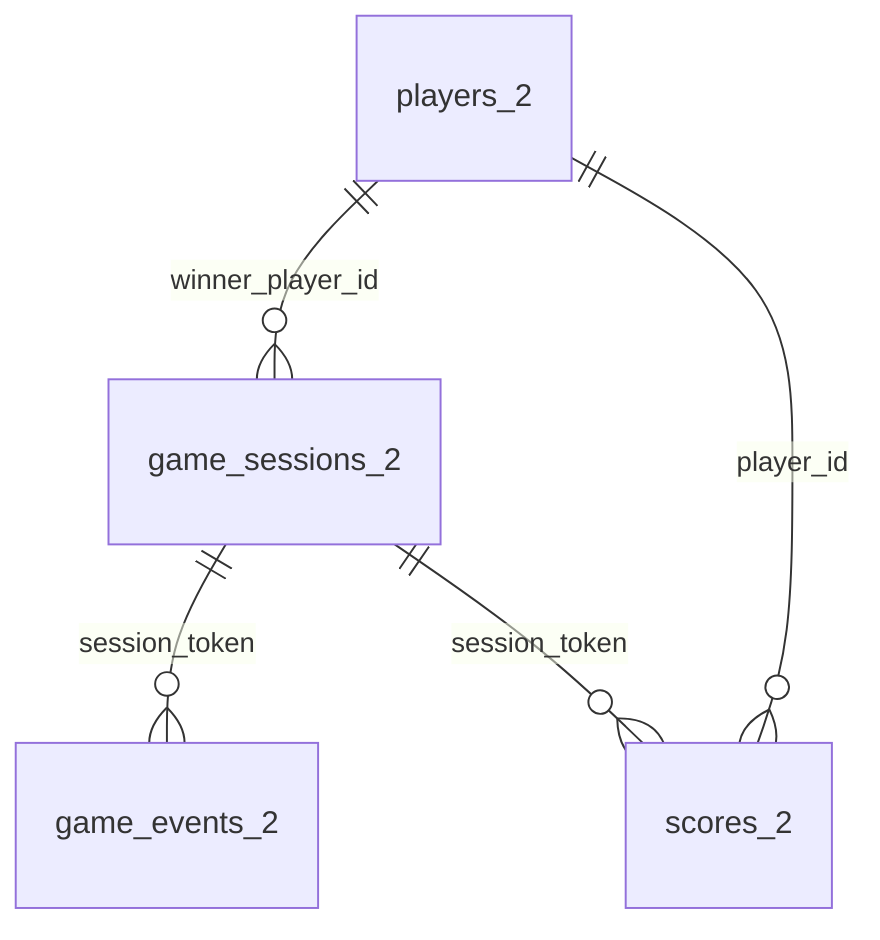

# Catch The Google

[Русская версия](./README.md)

[](https://alexander0yusov.github.io/catch-the-google/)
[](https://catch-the-google-backend.onrender.com/health)
[](https://github.com/Alexander0Yusov/catch-the-google)
[](./package.json)
[](./.nvmrc)

A real-time multiplayer grid game where two players chase a Google unit that periodically jumps to a random valid cell.

## Live Demo

- Frontend (GitHub Pages): https://alexander0yusov.github.io/catch-the-google/
- Backend health (Render): https://catch-the-google-backend.onrender.com/health

If your backend URL is different, update [config.js](./config.js).

## 1) Game Logic, Business Rules, and Technology Rationale

### Core rules

- The board size is `columns x rows`.
- `Player 1`, `Player 2`, and `Google` are always on the board.
- A player cannot move outside board borders.
- Two players cannot occupy the same cell.
- Catching Google gives `+1` point.
- After catch, Google relocates to a new valid cell.
- If nobody catches Google for `googleJumpInterval`, it jumps automatically.
- Turn order: `Player 1` moves first, then `Player 2`, then alternates.
- Delay between turns is configurable via `turnDelayMs` (default `250ms`).
- The match ends when:
  - someone reaches `pointsToWin`, or
  - `gameDurationMs` expires.

### Why these technologies

- **WebSocket (`ws`)**: low-latency two-way communication for synchronized multiplayer updates.
- **Remote Proxy**: frontend keeps the same API shape while game state is managed remotely.
- **EventEmitter (Observer)**: decoupled domain events with reactive UI updates.
- **Node.js backend**: single source of truth for rules and state transitions.
- **PostgreSQL (Neon)**: persistent sessions, events, and scores.

### Data flow



## 2) Project Structure and Dependencies

```text
CatchTheGoogle/
  back/
    migrations/
      001_init_2.sql
    db.js
    server.js
  css/
  docs/
    screenshots/
  domain/
  observer/
  config.js
  front.js
  game-remote-proxy.js
  game.js
  index.html
  render.yaml
  README.md
  README.en.md
```

### Module dependency graph



### Database schema (`_2` suffix required)

- `players_2`
- `game_sessions_2`
- `game_events_2`
- `scores_2`



## 3) Technology Stack

- Frontend/Core language: TypeScript sources (`.ts`) + generated `.js` for deployment runtime
- Backend: Node.js runtime + TypeScript sources
- Realtime: WebSocket (`ws`)
- Patterns: MVC (lightweight), Observer, Remote Proxy
- Database: PostgreSQL (Neon), `pg`
- Testing: `Vitest` (unit/integration/e2e), `ws` (e2e client)
- Audio: Web Audio API (quiet neutral loop controlled by `Sound on` switch)
- Deployment: GitHub Pages + Render

## 4) Why GitHub Pages + Render + Deployment Guide

### Why this setup

- **GitHub Pages**: ideal for static frontend in portfolio projects.
- **Render**: stable Node process with WebSocket support and health checks.
- **Neon**: managed PostgreSQL for persistent game data.

### Quick deploy

1. Backend: Render `Blueprint` from this repo (`render.yaml`).
2. Add Neon connection:
   - either `DATABASE_URL`
   - or `POSTGRES_HOST`, `POSTGRES_PORT`, `POSTGRES_USER`, `POSTGRES_PASSWORD`, `POSTGRES_DATABASE`.
3. Keep `AUTO_RUN_MIGRATIONS=false` to avoid changing existing tables.
4. Frontend: set `window.GAME_WS_URL` in `config.js`.
5. Enable GitHub Pages from `main` branch root.

## Screenshots and GIF

Add your media files to `docs/screenshots/`:

- `gameplay-start.png`
- `gameplay-win.png`
- `gameplay.gif`

## Tests

### Run

```bash
npm run build
npm test
npm run test:unit
npm run test:integration
npm run test:e2e
```

### Covered cases

- `Unit`:
  - `Position.clone/equal` behavior.
  - `EventEmitter` subscribe/emit/unsubscribe.
- `Integration`:
  - `Game.start` creates valid unique unit positions.
  - Turn order + `turnDelayMs` enforcement.
- `E2E`:
  - Start game via WebSocket request/response protocol.
  - Distinct role assignment for two clients.

Then they will render in the Russian README.
