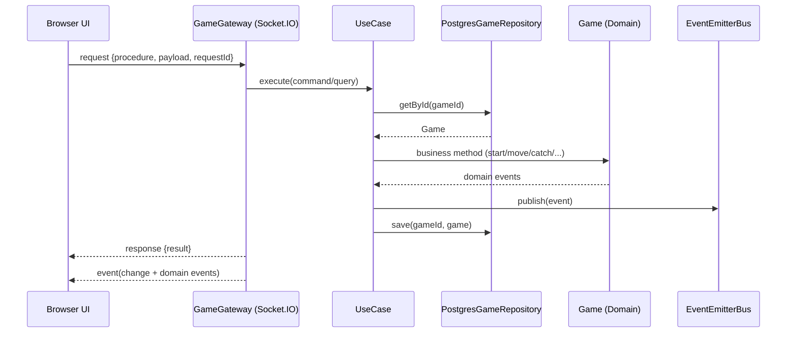
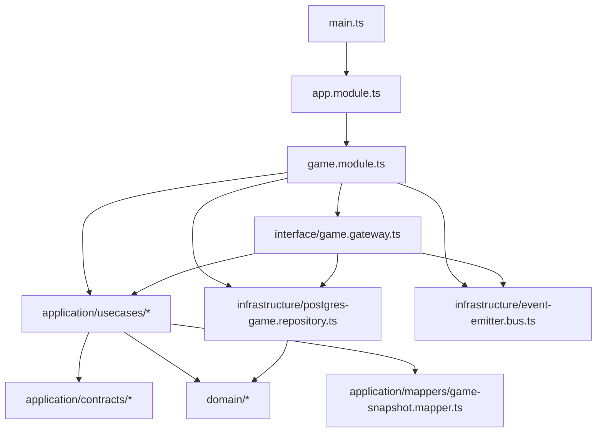
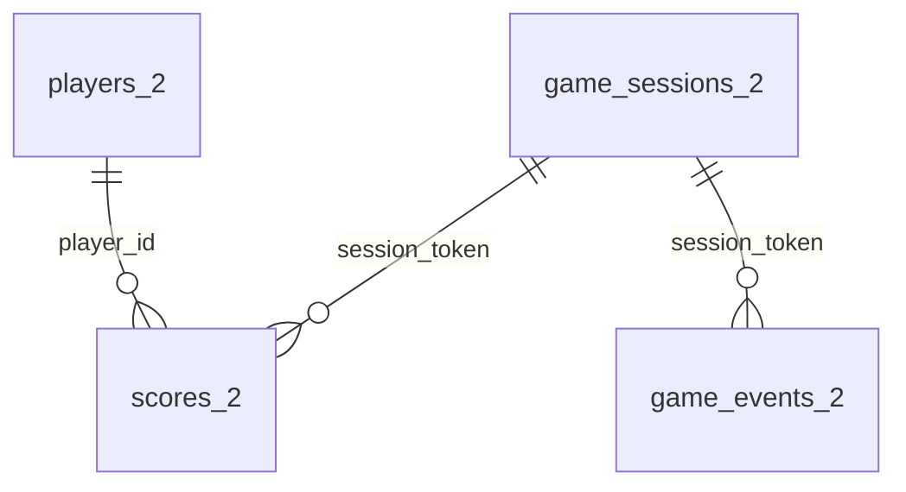

# Catch The Google

[Russian version](./README.md)

[](https://alexander0yusov.github.io/catch-the-google/)
[](https://catch-the-google-backend.onrender.com/health)
[](https://github.com/Alexander0Yusov/catch-the-google)
[](./package.json)
[](./.nvmrc)

A multiplayer grid game where two players compete to catch the Google unit faster.

## Live Demo

- Frontend (GitHub Pages): https://alexander0yusov.github.io/catch-the-google/
- Backend health (Render): https://catch-the-google-backend.onrender.com/health

If your backend URL is different, update [docs/config.js](./docs/config.js).

## 1) Game Description, Business Logic, and Technology Rationale

### Game behavior (actual rules)

- The board size is `columns x rows`.
- `Player 1`, `Player 2`, and `Google` are on the board at the same time.
- Players move independently; there is no turn-based queue now.
- The faster player to reach Google gets the point.
- Players cannot move outside the board.
- Players cannot occupy the same cell.
- If a player enters Google's cell, they get `+1` point.
- After a catch:
  - if `pointsToWin` is reached, the game finishes;
  - otherwise Google jumps to a new valid cell.
- The game supports `pause` and `resume`.
- Google jumps on a server-side timer while the game is active.

### Key business rules in code

- Domain model is isolated in `src/modules/game/domain`.
- Moves are allowed only in `in-progress` status.
- Coordinate validation is centralized in `Position.create(...)`.
- A player cannot move into another player's cell (`Player.move(...)`).
- Catch logic is checked in `Game.catch(playerId)` after movement.
- Domain events (`game-started`, `google-jumped`, `google-caught`, `game-finished`) are published from use cases to event bus.

### Why these technologies

- **NestJS**: modular structure, DI, clean application composition.
- **Socket.IO Gateway**: realtime channel between frontend and backend.
- **DDD + Clean Architecture**: business rules in domain, orchestration in application, adapters in infrastructure.
- **PostgreSQL (Neon) + `pg`**: session/score persistence with in-memory fallback.
- **Vitest + Playwright**: unit/integration/e2e coverage.

### Data flow


```mermaid
sequenceDiagram
  participant UI as Browser UI
  participant GW as GameGateway (Socket.IO)
  participant UC as UseCase
  participant REPO as PostgresGameRepository
  participant DOM as Game (Domain)
  participant BUS as EventEmitterBus

  UI->>GW: request {procedure, payload, requestId}
  GW->>UC: execute(command/query)
  UC->>REPO: getById(gameId)
  REPO-->>UC: Game
  UC->>DOM: business method (start/move/catch/...)
  DOM-->>UC: domain events
  UC->>BUS: publish(event)
  UC->>REPO: save(gameId, game)
  GW-->>UI: response {result}
  GW-->>UI: event(change + domain events)
```

---

## 2) Technology Stack

- **Backend**: NestJS, TypeScript, Node.js
- **Realtime**: Socket.IO (`@nestjs/websockets`, `@nestjs/platform-socket.io`)
- **Architecture**: Clean Architecture + DDD
- **Persistence**: PostgreSQL (Neon), `pg` (TypeORM is not used)
- **Config/validation**: `@nestjs/config` + `joi`
- **Testing**: Vitest, Playwright
- **Code quality**: ESLint
- **Frontend**: static files in `docs/` (GitHub Pages)

---

## 3) Project Structure, Dependencies, and DB

### Project folders (current)

```text
CatchTheGoogle/
  docs/                     # frontend (static client)
    index.html
    config.js
    dist/
  scripts/
    check-migrations.mjs
  src/
    main.ts
    app.module.ts
    modules/
      game/
        game.module.ts
        domain/
          entities/
          value-objects/
          services/
          events/
          enums/
          types/
        application/
          contracts/
          usecases/
          mappers/
        infrastructure/
          postgres-game.repository.ts
          event-emitter.bus.ts
        interface/
          game.gateway.ts
  tests/
    unit/
    integration/
    e2e/
  src/test/e2e/
  playwright.config.ts
  vitest.config.ts
  package.json
  README.md
```

### Module relations


```mermaid
graph TD
  Main[main.ts] --> AppModule[app.module.ts]
  AppModule --> GameModule[game.module.ts]
  GameModule --> Gateway[interface/game.gateway.ts]
  GameModule --> UCs[application/usecases/*]
  GameModule --> Repo[infrastructure/postgres-game.repository.ts]
  GameModule --> Bus[infrastructure/event-emitter.bus.ts]
  UCs --> Contracts[application/contracts/*]
  UCs --> Domain[domain/*]
  UCs --> Mapper[application/mappers/game-snapshot.mapper.ts]
  Repo --> Domain
  Gateway --> UCs
  Gateway --> Repo
  Gateway --> Bus
```

### Full class/interface map

#### Composition Root

- `AppModule` (`src/app.module.ts`)
  - Imports global `ConfigModule` and `GameModule`.
  - Validates env: `NODE_ENV`, `DATABASE_URL`, `PORT`, `CORS_ORIGIN`.
- `GameModule` (`src/modules/game/game.module.ts`)
  - Registers DI tokens:
    - `GAME_SESSION_REPOSITORY -> PostgresGameRepository`
    - `GAME_QUERY_REPOSITORY -> PostgresGameRepository`
    - `EVENT_BUS -> EventEmitterBus`
  - Registers all use cases and `GameGateway`.

#### Interface Layer

- `GameGateway` (`interface/game.gateway.ts`)
  - Implements `OnGatewayConnection`, `OnGatewayDisconnect`.
  - Calls use cases: `start`, `move`, `stop`, `pause`, `resume`, `setSettings`, `getSnapshot`.
  - Accepts procedures:
    - `joinGame`, `start`, `stop`, `pause`, `resume`, `setSettings`, `getSnapshot`
    - `movePlayer1Up/Down/Left/Right`, `movePlayer2Up/Down/Left/Right`
  - Broadcasts:
    - `event(change)` with snapshot
    - `game-started`, `google-jumped`, `google-caught`, `game-finished`

#### Application Layer

- Contracts (`application/contracts`):
  - `IEventBus`
  - `IGameSessionRepository`
  - `IGameQueryRepository`
  - tokens `GAME_SESSION_REPOSITORY`, `GAME_QUERY_REPOSITORY`, `EVENT_BUS`
- Use cases (`application/usecases`):
  - `StartGameUseCase`
  - `MovePlayerUseCase`
  - `StopGameUseCase`
  - `PauseGameUseCase`
  - `ResumeGameUseCase`
  - `SetSettingsUseCase`
  - `GetSnapshotQueryHandler`
- Mapper:
  - `gameSnapshotMapper(game): GameSnapshotDto`

#### Domain Layer

- `Game`:
  - lifecycle: `start`, `stop`, `pause`, `resume`, `finish`
  - gameplay: `move`, `catch`, `jumpGoogle`, `setGooglePosition`
  - read: `getStatus`, `getPlayer`, `getGooglePosition`, `getGridSize`, `getSettings`, `getScore`
- `Player`: `move`, `addPoint`, `resetPoints`, `setPosition`
- `Position`: `create`, `move`, `equals`
- `GooglePositionDomainService`: `nextPosition`
- `GameStatus`: `pending`, `in-progress`, `paused`, `finished`, `stopped`
- Domain events:
  - `GameStartedEvent`
  - `GoogleJumpedEvent`
  - `GoogleCaughtEvent`
  - `GameFinishedEvent`

#### Infrastructure Layer

- `EventEmitterBus`
  - `IEventBus` implementation using `node:events`
- `PostgresGameRepository`
  - implements `IGameSessionRepository`, `IGameQueryRepository`
  - modes:
    - PostgreSQL mode (when `DATABASE_URL` and schema are available)
    - in-memory fallback mode

### DB structure

Repository expects `_2` tables:

- `players_2`
- `game_sessions_2`
- `game_events_2`
- `scores_2`


```mermaid
erDiagram
  players_2 ||--o{ scores_2 : player_id
  game_sessions_2 ||--o{ scores_2 : session_token
  game_sessions_2 ||--o{ game_events_2 : session_token
```

---

## 4) Frontend - Backend Flow

### HTTP

| Method | Path | Purpose |
|---|---|---|
| GET | `/health` | backend health check |

### WebSocket (Socket.IO)

Client sends `request`:

```json
{ "type": "request", "requestId": "...", "procedure": "start", "payload": {} }
```

Server sends `response`:

```json
{ "type": "response", "requestId": "...", "procedure": "start", "result": { "status": "in-progress" } }
```

Server broadcasts:

- `event` with `eventName: "change"` and snapshot
- `game-started`
- `google-jumped`
- `google-caught`
- `game-finished`

---

## 5) Development and Testing

### Local run

```bash
npm install
npm run build
npm run start:back
npm run start:front
```

### Test commands

```bash
npm test
npm run test:unit
npm run test:integration
npm run test:e2e
```

### Current check status (verified locally)

- `npm run build:ts` passes.
- `npm run lint` passes (warnings only, no errors).
- `npm run check:migrations` passes.
- `npm test` passes.
- `npm run test:unit` passes.
- `npm run test:integration` passes.
- `npm run test:e2e` passes.

---

## 6) Linting and Checks

### Commands

```bash
npm run lint
npm run lint:fix
npm run check:migrations
npm run build:ts
```

Migration note:

- `check:migrations` validates `back/migrations/001_init_2.sql`.
- The migration exists and contains required `_2` table fragments.

---

## 7) Why GitHub Pages + Render and How to Deploy

### Why this setup

- **GitHub Pages**: static frontend hosting.
- **Render**: runtime for NestJS + Socket.IO backend.
- **Neon**: managed PostgreSQL for production.

### Backend (Render)

1. Create a service from this repository.
2. Set env variables:
   - `NODE_ENV=production`
   - `DATABASE_URL`
   - `PORT`
   - `CORS_ORIGIN`
3. Check `/health`.

### Frontend (GitHub Pages)

1. Set `window.GAME_WS_URL` in [docs/config.js](./docs/config.js):

```js
window.GAME_WS_URL = "wss://<your-render-service>.onrender.com";
```

2. Deploy `docs/` to GitHub Pages.

---

## 8) Screenshots

There is currently no `docs/screenshots` folder or PNG screenshots in the repository.

Available frontend assets are in `docs/img` and `docs/img/icons`.
