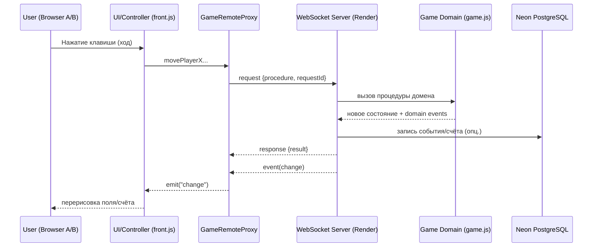
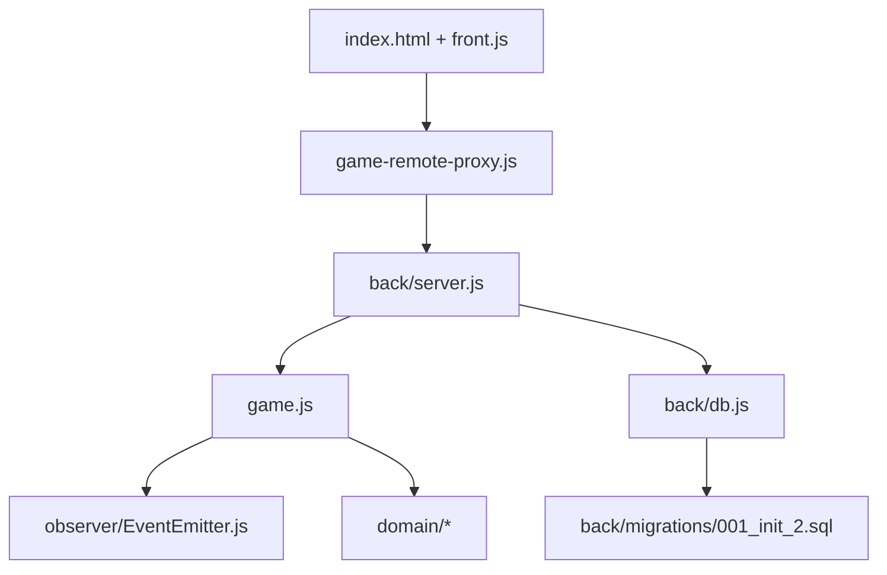
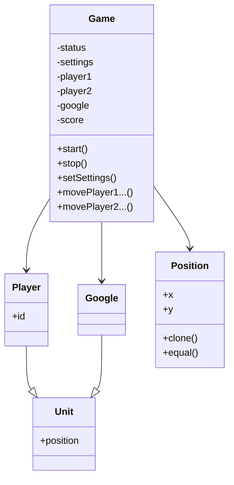
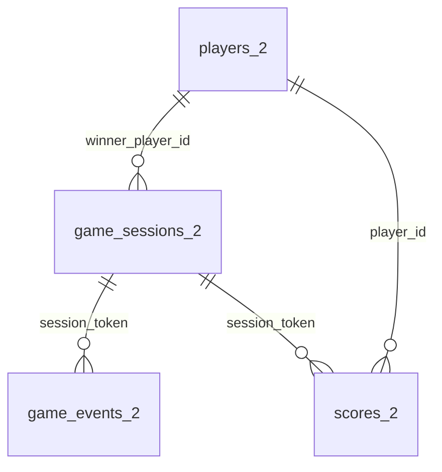

# Catch The Google

[English version](./README.en.md)

[](https://alexander0yusov.github.io/catch-the-google/)
[](https://catch-the-google-backend.onrender.com/health)
[](https://github.com/Alexander0Yusov/catch-the-google)
[](./package.json)
[](./.nvmrc)

Мультиплеерная игра «догонялки» в клеточном поле: два игрока пытаются поймать Google-юнит, который периодически «прыгает» в новую клетку.

## Live Demo

- Frontend (GitHub Pages): https://alexander0yusov.github.io/catch-the-google/
- Backend health (Render): https://catch-the-google-backend.onrender.com/health

Если backend URL отличается от указанного, обновите [config.js](./config.js).

## 1) Описание игры, бизнес-логика и целесообразность технологий

### Что делает игра

- Игровое поле имеет размер `columns x rows`.
- На поле одновременно находятся `Player 1`, `Player 2` и `Google`.
- Игроки двигаются по стрелкам (роль выбирается в UI).
- Игроки не могут выйти за границы поля.
- Игроки не могут находиться в одной клетке.
- Если игрок заходит в клетку `Google`, он получает `+1` очко.
- После поимки `Google` переносится в новую валидную клетку.
- Если `Google` не пойман в течение `googleJumpInterval`, он сам прыгает в новую клетку.
- Очередность ходов: сначала `Player 1`, затем `Player 2`, далее по кругу.
- Пауза между ходами задаётся параметром `turnDelayMs` (по умолчанию `250` мс).
- Матч заканчивается:
  - когда кто-то достиг `pointsToWin`, или
  - когда истекло `gameDurationMs`.

### Ключевые бизнес-правила в коде

- Доменная логика изолирована в [game.js](./game.js) и не зависит от DOM/браузера.
- Проверка валидности хода:
  - границы поля (`#checkBorders`),
  - занятость клетки другим игроком (`#checkOtherPlayer`).
- Поимка Google и обновление счёта (`#checkGoogleCatching`).
- Смена статусов игры (`pending`, `in-progress`, `paused`, `finished`, `stopped`).
- Таймеры:
  - `setInterval` для прыжков Google,
  - `setTimeout` для завершения матча по времени.
- Поток ходов:
  - `firstTurnPlayerId=1` — первый ход делает Player 1;
  - после успешного хода активный игрок переключается;
  - следующий ход разрешается только после `turnDelayMs`.

### Почему применены именно эти технологии

- **WebSocket (`ws`)**: нужен двунаправленный канал и «живые» обновления в реальном времени между несколькими клиентами.
- **Remote Proxy**: фронт работает с тем же интерфейсом, что и локальная игра, но фактически вызывает удалённый сервер.
- **EventEmitter (Observer)**: домен публикует события изменений, сервер транслирует их всем клиентам.
- **Node.js backend**: единый источник истины для координат/очков/статусов.
- **PostgreSQL (Neon)**: хранение игровых сессий и событий матча.

### Ситуативная отработка технологий (когда и зачем)

- **Observer** используется, когда состояние меняется независимо от конкретного клиента (например, таймер Google).
- **WebSocket broadcast** используется, когда одно действие в одном браузере должно мгновенно отражаться во втором.
- **Remote Proxy** уместен, когда UI должен остаться «тонким», а бизнес-логика переносится на сервер.
- **БД (опционально)** включается для портфолио-ценности: аналитика матчей, история сессий, лидерборды.

### Flow обмена данными



---

## 2) Стек технологий

- **Frontend**: HTML, CSS, TypeScript (исходники `.ts`) + сборка в `dist/*.js`
- **Backend**: Node.js (runtime) + TypeScript (исходники)
- **Realtime**: `ws` (WebSocket)
- **Архитектурные паттерны**: MVC (упрощённо), Observer, Remote Proxy
- **База данных**: PostgreSQL (Neon), пакет `pg`
- **Качество кода**: ESLint (TS + JS)
- **Тестирование**: `Vitest` (unit/integration/e2e), `ws` (e2e клиент)
- **Аудио**: HTMLAudioElement + Web Audio API fallback (`get-low.mp3` тихо, через `Sound on`)
- **Деплой backend**: Render
- **Деплой frontend**: GitHub Pages

---

## 3) Структура проекта, зависимости и БД

### Каталоги проекта

```text
CatchTheGoogle/
  back/
    migrations/
      001_init_2.sql
    db.js
    server.js
  css/
    common.css
    null.css
    style.css
  docs/
    screenshots/
      .gitkeep
      gameplay-start.png (добавьте)
      gameplay-win.png (добавьте)
      gameplay.gif (добавьте)
  domain/
    Google.js
    NumberUtil.js
    Player.js
    Position.js
    Unit.js
  img/
  observer/
    EventEmitter.js
  config.js
  front.js
  game-remote-proxy.js
  game.js
  index.html
  package.json
  render.yaml
  README.md
  README.en.md
```

### Граф зависимостей между модулями



### Зависимости классов (Domain)



### Структура БД и зависимости

Важно: все таблицы имеют суффикс `_2`.

- `players_2` — справочник игроков.
- `game_sessions_2` — сессии матчей.
- `game_events_2` — поток событий в матче.
- `scores_2` — актуальные очки игроков в рамках сессии.



---

## 4) Флоу Frontend ↔ Backend

В проекте игровой обмен полностью идет через **WebSocket**, HTTP используется только для health-check.

### HTTP (минимум)

| Шаг | Метод/путь | Кто отправляет | Тело | Ответ |
|---|---|---|---|---|
| 1 | `GET /health` | Render health-check / браузер | нет | `{ ok: true, service: "catch-the-google-backend" }` |

### WebSocket (основной протокол)

| Порядок | Канал | Кто -> Куда | Сообщение | Что делает сервер | Ответ |
|---|---|---|---|---|---|
| 1 | WS connect | Front -> Back | handshake | регистрирует соединение | `event(change)` с текущим snapshot |
| 2 | request | Front -> Back | `{ type: "request", requestId, procedure: "joinGame", payload }` | назначает роль игрока | `response { result: { playerId } }` |
| 3 | request | Front -> Back | `procedure: "setSettings"` | обновляет настройки матча | `response { result: snapshot }` |
| 4 | request | Front -> Back | `procedure: "start"` | создаёт юниты, запускает таймеры | `response { result: snapshot }` |
| 5 | request | Front -> Back | `procedure: "movePlayer..."` | валидирует ход, обновляет состояние | `response { result: snapshot }` |
| 6 | event | Back -> Front(all) | `{ type: "event", eventName: "change", data }` | транслирует изменения всем клиентам | UI перерисовывает поле/счет |
| 7 | event | Back -> Front(all) | `eventName: "googleCaught"/"finished"` | доменные события | UI показывает результат/модалку |
| 8 | request | Front -> Back | `procedure: "stop"` | останавливает матч | `response { result: snapshot }` |

Документация протокола:
- HTTP docs UI: `GET /api-docs` (Render: https://catch-the-google-backend.onrender.com/api-docs)
- WebSocket docs UI: `GET /ws-docs` (Render: https://catch-the-google-backend.onrender.com/ws-docs)
- HTTP/OpenAPI spec: [openapi.yaml](./docs/api/openapi.yaml)
- WebSocket/AsyncAPI spec: [asyncapi.yaml](./docs/api/asyncapi.yaml)

---

## 5) Тесты

### Как запускать

```bash
npm run build
npm test
npm run test:unit
npm run test:integration
npm run test:e2e
```

### Наборы и кейсы

- `Unit`:
  - `Position.clone/equal` — корректность копирования и сравнения координат.
  - `EventEmitter` — доставка события и корректная отписка.
- `Integration`:
  - `Game.start` — инициализация юнитов и уникальность позиций.
  - Очерёдность хода и `turnDelayMs` — блокировка раннего/чужого хода.
- `E2E` (реальный WebSocket сервер + клиент):
  - Запуск матча через протокол request/response.
  - Выдача ролей двум клиентам (`Player 1` и `Player 2`).

## 6) Линтинг и правила ESLint

### Команды

```bash
npm run lint
npm run lint:fix
npm run check:migrations
```

### Ключевые правила и зачем они нужны

| Правило | Для чего |
|---|---|
| `eqeqeq` | исключает неявные приведения типов в критичной игровой логике |
| `@typescript-eslint/no-unused-vars` | убирает «мертвый» код и неиспользуемые параметры |
| `import/order` | поддерживает стабильный порядок импортов, проще ревью и диффы |
| `@typescript-eslint/consistent-type-imports` | делает TS-импорты предсказуемыми и чище сборку |
| `no-console` = off (осознанно) | в сервере логирование важно для диагностики деплоя/WS |

---

## 7) Почему GitHub Pages + Render и как деплоить

### Почему такой деплой

- **GitHub Pages** хорошо подходит для статического фронта: просто, бесплатно, удобно для портфолио.
- **Render** подходит для постоянного backend-процесса с WebSocket и healthcheck.
- **Neon** даёт managed PostgreSQL без поднятия отдельного сервера.

### Краткая инструкция

#### Backend (Render)

1. В Render: `New + -> Blueprint`.
2. Указать этот репозиторий.
3. Render прочитает [render.yaml](./render.yaml).
4. В env добавить подключение к Neon:
   - либо `DATABASE_URL`
   - либо `POSTGRES_HOST`, `POSTGRES_PORT`, `POSTGRES_USER`, `POSTGRES_PASSWORD`, `POSTGRES_DATABASE`
5. Убедиться, что `AUTO_RUN_MIGRATIONS=false` (по умолчанию), чтобы не менять существующие таблицы.
6. Проверить `https://<service>.onrender.com/health`.

#### Frontend (GitHub Pages)

1. В [config.js](./config.js) указать backend URL:

```js
window.GAME_WS_URL = "wss://<your-render-service>.onrender.com";
```

2. Запушить изменения в `main`.
3. GitHub: `Settings -> Pages -> Deploy from branch`.
4. Branch: `main`, folder: `/ (root)`.

---

## 8) Скриншоты

### Gameplay start

`./docs/screenshots/gameplay-start.png`

### Gameplay win state

`./docs/screenshots/gameplay-win.png`

### Gameplay (main)

`./docs/screenshots/gameplay.png`
