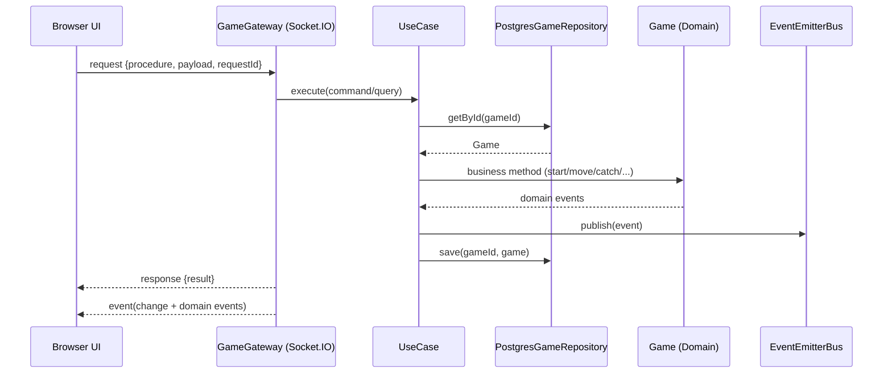
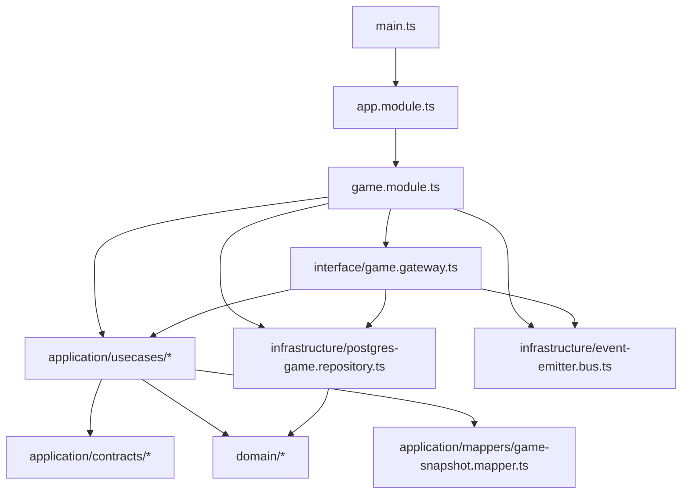
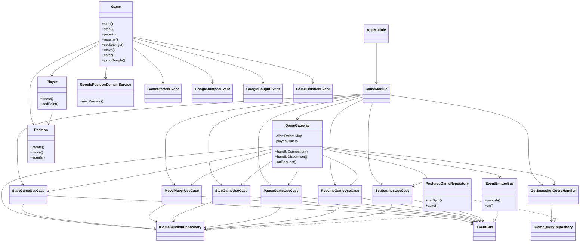
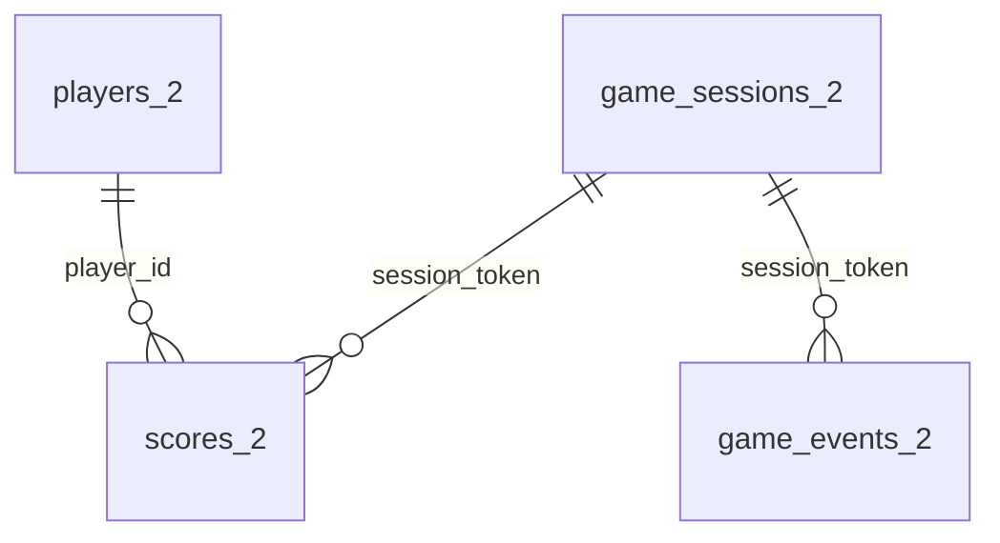
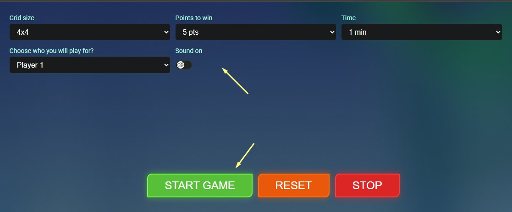
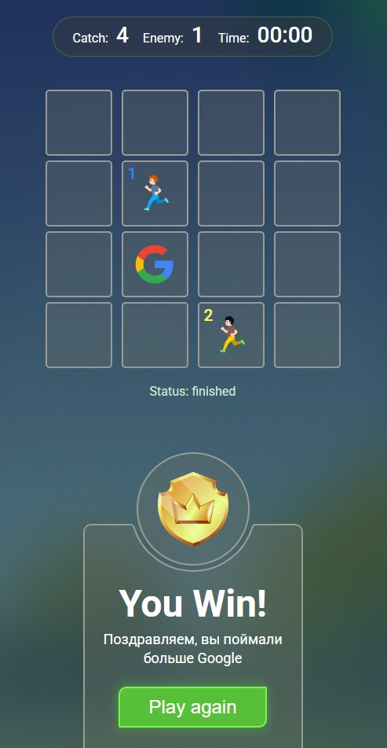
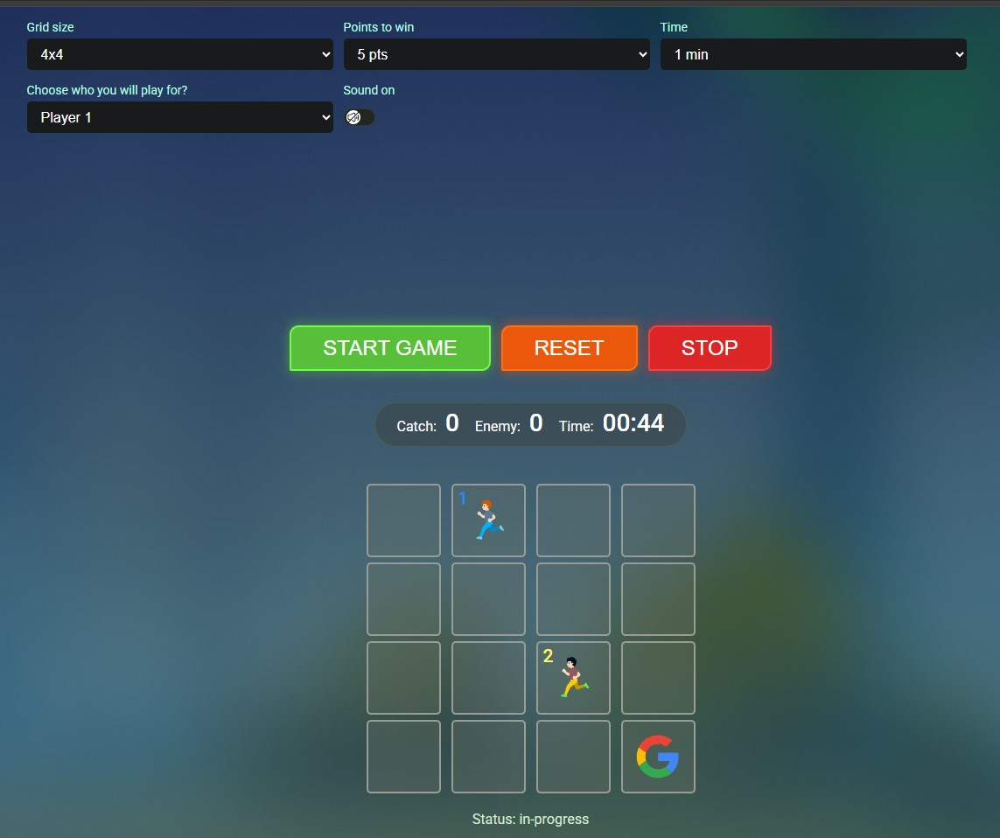

# Catch The Google

[English version](./README.en.md)

[](https://alexander0yusov.github.io/catch-the-google/)
[](https://catch-the-google-backend.onrender.com/health)
[](https://github.com/Alexander0Yusov/catch-the-google)
[](./package.json)
[](./.nvmrc)

Мультиплеерная игра в клеточном поле: два игрока соревнуются, кто быстрее поймает Google-юнит.

## Live Demo

- Frontend (GitHub Pages): https://alexander0yusov.github.io/catch-the-google/
- Backend health (Render): https://catch-the-google-backend.onrender.com/health

Если backend URL отличается от указанного, обновите [docs/config.js](./docs/config.js).

## 1) Описание игры, бизнес-логика и целесообразность технологий

### Что делает игра (фактические правила)

- Поле имеет размер `columns x rows`.
- На поле одновременно находятся `Player 1`, `Player 2` и `Google`.
- Игроки двигаются независимо друг от друга. Пошаговой очереди ходов сейчас нет.
- Результат определяется скоростью действий: кто быстрее добегает до клетки Google, тот получает очко.
- Игроки не могут выходить за границы поля.
- Игроки не могут занимать одну и ту же клетку.
- Если игрок входит в клетку Google, он получает `+1` очко.
- После поимки Google:
  - если достигнут `pointsToWin`, игра завершается;
  - иначе Google прыгает в новую валидную клетку.
- Матч может быть остановлен, поставлен на паузу и возобновлен.
- Google прыгает по таймеру на серверной стороне при активной игре (интервал из настроек).

### Ключевые бизнес-правила в коде

- Доменная модель изолирована в `src/modules/game/domain`.
- Движение разрешено только в статусе `in-progress`.
- Проверка корректности координат централизована в `Position.create(...)`.
- Нельзя занять клетку другого игрока (`Player.move(...)`).
- Поимка Google проверяется в `Game.catch(playerId)` сразу после перемещения.
- События домена (`game-started`, `google-jumped`, `google-caught`, `game-finished`) публикуются из use case в event bus.

### Почему применены именно эти технологии

- **NestJS**: модульность, DI-контейнер, удобная реализация Clean Architecture.
- **Socket.IO Gateway**: стабильный realtime-канал фронт <-> сервер.
- **DDD + Clean Architecture**: бизнес-правила в domain, orchestration в application, адаптеры в infrastructure.
- **PostgreSQL (Neon) + TypeORM/pg-подход в инфраструктуре**: хранение сессий и счета; fallback в in-memory при отсутствии DB.
- **Vitest + Playwright**: покрытие unit/integration/e2e.

### Flow обмена данными


```mermaid
sequenceDiagram
  participant UI as Browser UI
  participant GW as GameGateway (Socket.IO)
  participant UC as UseCase
  participant REPO as PostgresGameRepository
  participant DOM as Game (Domain)
  participant BUS as EventEmitterBus

  UI->>GW: request {procedure, payload, requestId}
  GW->>UC: execute(command/query)
  UC->>REPO: getById(gameId)
  REPO-->>UC: Game
  UC->>DOM: business method (start/move/catch/...)
  DOM-->>UC: domain events
  UC->>BUS: publish(event)
  UC->>REPO: save(gameId, game)
  GW-->>UI: response {result}
  GW-->>UI: event(change + domain events)
```

---

## 2) Стек технологий

- **Backend**: NestJS, TypeScript, Node.js
- **Realtime**: Socket.IO (`@nestjs/websockets`, `@nestjs/platform-socket.io`)
- **Архитектура**: Clean Architecture + DDD
- **Persistence**: PostgreSQL (Neon), `pg`
- **Конфигурация/валидация env**: `@nestjs/config` + `joi`
- **Тесты**: Vitest, Playwright
- **Качество кода**: ESLint
- **Frontend**: статические файлы в `docs/` (GitHub Pages)

---

## 3) Структура проекта, зависимости и БД

### Каталоги проекта (актуально)

```text
CatchTheGoogle/
  docs/                     # фронт (статический клиент)
    index.html
    config.js
    dist/
  scripts/
    check-migrations.mjs
  src/
    main.ts
    app.module.ts
    modules/
      game/
        game.module.ts
        domain/
          entities/
          value-objects/
          services/
          events/
          enums/
          types/
        application/
          contracts/
          usecases/
          mappers/
        infrastructure/
          postgres-game.repository.ts
          event-emitter.bus.ts
        interface/
          game.gateway.ts
  tests/
    unit/
    integration/
    e2e/
  playwright.config.ts
  vitest.config.ts
  package.json
  README.md
```

### Связи модулей


```mermaid
graph TD
  Main[main.ts] --> AppModule[app.module.ts]
  AppModule --> GameModule[game.module.ts]
  GameModule --> Gateway[interface/game.gateway.ts]
  GameModule --> UCs[application/usecases/*]
  GameModule --> Repo[infrastructure/postgres-game.repository.ts]
  GameModule --> Bus[infrastructure/event-emitter.bus.ts]
  UCs --> Contracts[application/contracts/*]
  UCs --> Domain[domain/*]
  UCs --> Mapper[application/mappers/game-snapshot.mapper.ts]
  Repo --> Domain
  Gateway --> UCs
  Gateway --> Repo
  Gateway --> Bus
```

### Полная карта классов/интерфейсов и их связей

#### Composition Root

- `AppModule` (`src/app.module.ts`)
  - Импортирует `ConfigModule` (global) и `GameModule`.
  - Валидирует env: `NODE_ENV`, `DATABASE_URL`, `PORT`, `CORS_ORIGIN`.
- `GameModule` (`src/modules/game/game.module.ts`)
  - Регистрирует провайдеры и DI-токены:
    - `GAME_SESSION_REPOSITORY -> PostgresGameRepository`
    - `GAME_QUERY_REPOSITORY -> PostgresGameRepository`
    - `EVENT_BUS -> EventEmitterBus`
  - Регистрирует все use case классы и `GameGateway`.

#### Interface Layer

- `GameGateway` (`interface/game.gateway.ts`)
  - Реализует `OnGatewayConnection`, `OnGatewayDisconnect`.
  - Зависит от:
    - `StartGameUseCase`, `MovePlayerUseCase`, `StopGameUseCase`, `PauseGameUseCase`, `ResumeGameUseCase`, `SetSettingsUseCase`, `GetSnapshotQueryHandler`
    - `IGameSessionRepository`
    - `EventEmitterBus`
    - `ConfigService`
  - Протокол процедур:
    - `joinGame`, `start`, `stop`, `pause`, `resume`, `setSettings`, `getSnapshot`
    - `movePlayer1Up/Down/Left/Right`, `movePlayer2Up/Down/Left/Right`
  - Публикует во все клиенты:
    - `event(change)` со snapshot
    - доменные события `game-started`, `google-jumped`, `google-caught`, `game-finished`

#### Application Layer

- Контракты (`application/contracts`):
  - `IEventBus`: `publish(event)`
  - `IGameSessionRepository`: `getById`, `save`
  - `IGameQueryRepository`: `getById`
  - `tokens.ts`: `GAME_SESSION_REPOSITORY`, `GAME_QUERY_REPOSITORY`, `EVENT_BUS`
- Use cases (`application/usecases`):
  - `StartGameUseCase`: `Game.start()` -> publish events -> save
  - `MovePlayerUseCase`: `Game.move()` + `Game.catch()` -> publish events -> save
  - `StopGameUseCase`: `Game.stop()` -> publish events -> save
  - `PauseGameUseCase`: `Game.pause()` -> publish events -> save
  - `ResumeGameUseCase`: `Game.resume()` -> publish events -> save
  - `SetSettingsUseCase`: `Game.setSettings()` -> publish events -> save
  - `GetSnapshotQueryHandler`: читает игру через `IGameQueryRepository` и маппит в DTO
- Mapper (`application/mappers/game-snapshot.mapper.ts`):
  - `gameSnapshotMapper(game: Game): GameSnapshotDto`
  - Формирует transport-friendly DTO для клиента.

#### Domain Layer

- `Game` (`domain/entities/game.entity.ts`)
  - Центральный агрегат: статус, настройки, игроки, позиция Google, domain events.
  - Зависит от: `Player`, `Position`, `GooglePositionDomainService`, `GameStatus`, domain event classes.
  - Методы:
    - lifecycle: `start`, `stop`, `pause`, `resume`, `finish`
    - config: `setSettings`
    - gameplay: `move`, `catch`, `jumpGoogle`, `setGooglePosition`
    - read: `getStatus`, `getPlayer`, `getGooglePosition`, `getGridSize`, `getSettings`, `getScore`, `getDomainEvents`, `clearDomainEvents`
- `Player` (`domain/entities/player.entity.ts`)
  - Состояние: `id`, `position`, `points`.
  - Методы: `move`, `addPoint`, `resetPoints`, `setPosition`.
- `Position` (`domain/value-objects/position.value-object.ts`)
  - Immutable VO координат.
  - Методы: `create`, `move`, `equals`.
- `GooglePositionDomainService` (`domain/services/google-position.domain-service.ts`)
  - Вычисляет следующую позицию Google с исключением занятых клеток.
- `GameStatus` (`domain/enums/game-status.enum.ts`)
  - `pending`, `in-progress`, `paused`, `finished`, `stopped`.
- Domain events (`domain/events/*`):
  - `GameStartedEvent`
  - `GoogleJumpedEvent`
  - `GoogleCaughtEvent`
  - `GameFinishedEvent`

#### Infrastructure Layer

- `EventEmitterBus` (`infrastructure/event-emitter.bus.ts`)
  - Реализация `IEventBus` на `node:events`.
  - Методы: `publish(event)`, `on(eventName, callback)`.
- `PostgresGameRepository` (`infrastructure/postgres-game.repository.ts`)
  - Реализует `IGameSessionRepository`, `IGameQueryRepository`, `OnModuleInit`, `OnModuleDestroy`.
  - Режимы:
    - с `DATABASE_URL` + валидной схемой: чтение/запись в PostgreSQL
    - без DB/без схемы: in-memory fallback
  - Хранит `game_sessions_2.settings_json` (state snapshot) и upsert в `scores_2`.
  - На старте проверяет схему (`players_2`, `game_sessions_2`, `game_events_2`, `scores_2`).

### Диаграмма классов


```mermaid
classDiagram
  class AppModule
  class GameModule

  class GameGateway {
    -clientRoles: Map
    -playerOwners
    +handleConnection()
    +handleDisconnect()
    +onRequest()
  }

  class StartGameUseCase
  class MovePlayerUseCase
  class StopGameUseCase
  class PauseGameUseCase
  class ResumeGameUseCase
  class SetSettingsUseCase
  class GetSnapshotQueryHandler

  class IGameSessionRepository
  class IGameQueryRepository
  class IEventBus

  class PostgresGameRepository {
    +getById()
    +save()
  }

  class EventEmitterBus {
    +publish()
    +on()
  }

  class Game {
    +start()
    +stop()
    +pause()
    +resume()
    +setSettings()
    +move()
    +catch()
    +jumpGoogle()
  }

  class Player {
    +move()
    +addPoint()
  }

  class Position {
    +create()
    +move()
    +equals()
  }

  class GooglePositionDomainService {
    +nextPosition()
  }

  class GameStartedEvent
  class GoogleJumpedEvent
  class GoogleCaughtEvent
  class GameFinishedEvent

  AppModule --> GameModule
  GameModule --> GameGateway
  GameModule --> StartGameUseCase
  GameModule --> MovePlayerUseCase
  GameModule --> StopGameUseCase
  GameModule --> PauseGameUseCase
  GameModule --> ResumeGameUseCase
  GameModule --> SetSettingsUseCase
  GameModule --> GetSnapshotQueryHandler

  GameGateway --> StartGameUseCase
  GameGateway --> MovePlayerUseCase
  GameGateway --> StopGameUseCase
  GameGateway --> PauseGameUseCase
  GameGateway --> ResumeGameUseCase
  GameGateway --> SetSettingsUseCase
  GameGateway --> GetSnapshotQueryHandler
  GameGateway --> IGameSessionRepository
  GameGateway --> EventEmitterBus

  StartGameUseCase --> IGameSessionRepository
  StartGameUseCase --> IEventBus
  MovePlayerUseCase --> IGameSessionRepository
  MovePlayerUseCase --> IEventBus
  StopGameUseCase --> IGameSessionRepository
  StopGameUseCase --> IEventBus
  PauseGameUseCase --> IGameSessionRepository
  PauseGameUseCase --> IEventBus
  ResumeGameUseCase --> IGameSessionRepository
  ResumeGameUseCase --> IEventBus
  SetSettingsUseCase --> IGameSessionRepository
  SetSettingsUseCase --> IEventBus
  GetSnapshotQueryHandler --> IGameQueryRepository

  PostgresGameRepository ..|> IGameSessionRepository
  PostgresGameRepository ..|> IGameQueryRepository
  EventEmitterBus ..|> IEventBus

  Game --> Player
  Game --> Position
  Game --> GooglePositionDomainService
  Game --> GameStartedEvent
  Game --> GoogleJumpedEvent
  Game --> GoogleCaughtEvent
  Game --> GameFinishedEvent
  Player --> Position
```

### Структура БД и зависимости

Важно: текущая репозиторная реализация ожидает таблицы с суффиксом `_2`.

- `players_2` — игроки
- `game_sessions_2` — сессии (`session_token`, `status`, `settings_json`)
- `game_events_2` — события игры (используется как обязательная таблица схемы)
- `scores_2` — очки игроков по сессии


```mermaid
erDiagram
  players_2 ||--o{ scores_2 : player_id
  game_sessions_2 ||--o{ scores_2 : session_token
  game_sessions_2 ||--o{ game_events_2 : session_token
```

---

## 4) Флоу Frontend - Backend

### HTTP

| Метод | Путь | Назначение |
|---|---|---|
| GET | `/health` | проверка доступности backend |

### WebSocket (Socket.IO)

Клиент отправляет событие `request` с payload:

```json
{ "type": "request", "requestId": "...", "procedure": "start", "payload": {} }
```

Сервер отвечает событием `response`:

```json
{ "type": "response", "requestId": "...", "procedure": "start", "result": { "status": "in-progress" } }
```

Сервер рассылает широковещательные события:

- `event` c `eventName: "change"` и полным snapshot
- `game-started`
- `google-jumped`
- `google-caught`
- `game-finished`

---

## 5) Разработка и тесты

### Локальный запуск

```bash
npm install
npm run build
npm run start:back
npm run start:front
```

Для локальной разработки обычно два терминала:

1. `npm run start:back`
2. `npm run start:front`

### Тесты

```bash
npm test
npm run test:unit
npm run test:integration
npm run test:e2e
```

Покрытие по уровням:

- `unit`: value object и utility-поведение.
- `integration`: поведение игровой модели на уровне сценариев.
- `e2e`: сетевое взаимодействие клиента и сервера.

---

## 6) Линтинг и проверки

### Команды

```bash
npm run lint
npm run lint:fix
npm run check:migrations
```

`check:migrations` проверяет наличие SQL-миграции и обязательных фрагментов таблиц `_2`.

---

## 7) Почему GitHub Pages + Render и как деплоить

### Почему такой деплой

- **GitHub Pages**: простой хостинг статического фронтенда.
- **Render**: стабильный runtime для NestJS + Socket.IO.
- **Neon**: managed PostgreSQL для production-окружения.

### Backend (Render)

1. Создать сервис из репозитория.
2. Указать переменные окружения:
   - `NODE_ENV=production`
   - `DATABASE_URL`
   - `PORT`
   - `CORS_ORIGIN`
3. Проверить `/health`.

### Frontend (GitHub Pages)

1. Указать `window.GAME_WS_URL` в [docs/config.js](./docs/config.js):

```js
window.GAME_WS_URL = "wss://<your-render-service>.onrender.com";
```

2. Задеплоить `docs/` в Pages.

---

## 8) Скриншоты

### Gameplay start



### Gameplay win state



### Gameplay (main)


