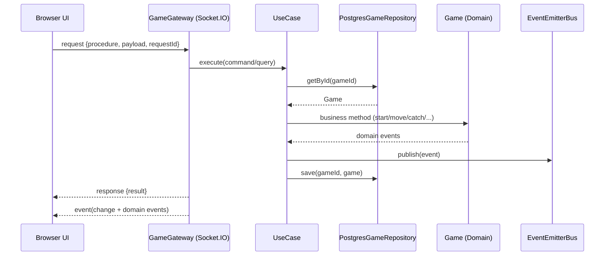
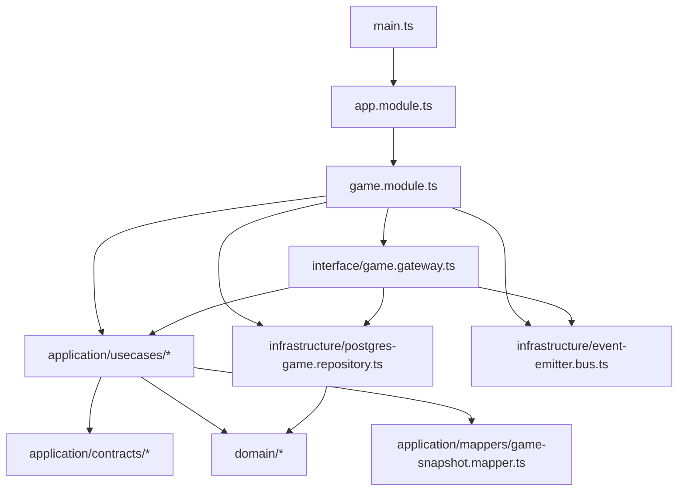
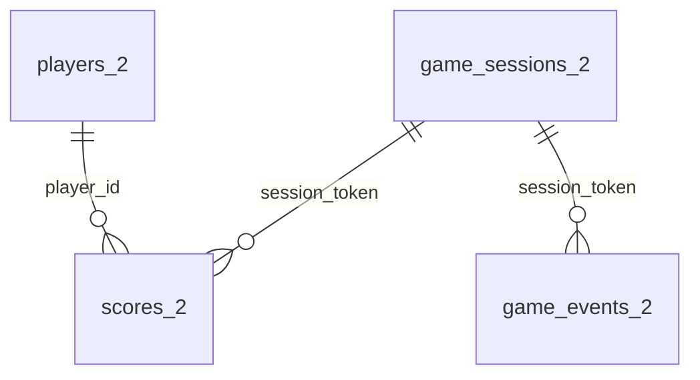

# Catch The Google

[English version](./README.en.md)

[](https://alexander0yusov.github.io/catch-the-google/)
[](https://catch-the-google-backend.onrender.com/health)
[](https://github.com/Alexander0Yusov/catch-the-google)
[](./package.json)
[](./.nvmrc)

Мультиплеерная игра в клеточном поле: два игрока соревнуются, кто быстрее поймает Google-юнит.

## Live Demo

- Frontend (GitHub Pages): https://alexander0yusov.github.io/catch-the-google/
- Backend health (Render): https://catch-the-google-backend.onrender.com/health

Если backend URL отличается от указанного, обновите [docs/config.js](./docs/config.js).

## 1) Описание игры, бизнес-логика и целесообразность технологий

### Что делает игра (фактические правила)

- Поле имеет размер `columns x rows`.
- На поле одновременно находятся `Player 1`, `Player 2` и `Google`.
- Игроки двигаются независимо друг от друга, пошаговой очереди ходов нет.
- Кто быстрее добегает до клетки Google, тот получает очко.
- Игроки не могут выходить за границы поля.
- Игроки не могут занимать одну и ту же клетку.
- Если игрок входит в клетку Google, он получает `+1` очко.
- После поимки Google:
  - если достигнут `pointsToWin`, игра завершается;
  - иначе Google прыгает в новую валидную клетку.
- Игра поддерживает `pause` и `resume`.
- Google прыгает по серверному таймеру при активной игре.

### Ключевые бизнес-правила в коде

- Доменная модель изолирована в `src/modules/game/domain`.
- Движение разрешено только в статусе `in-progress`.
- Проверка координат централизована в `Position.create(...)`.
- Нельзя занять клетку другого игрока (`Player.move(...)`).
- Поимка Google проверяется в `Game.catch(playerId)` после перемещения.
- Доменные события (`game-started`, `google-jumped`, `google-caught`, `game-finished`) публикуются из use cases в event bus.

### Почему применены именно эти технологии

- **NestJS**: модульность, DI, удобная реализация Clean Architecture.
- **Socket.IO Gateway**: realtime-канал фронт <-> сервер.
- **DDD + Clean Architecture**: бизнес-правила в domain, orchestration в application, адаптеры в infrastructure.
- **PostgreSQL (Neon) + `pg`**: хранение сессий и счета; fallback в in-memory при отсутствии DB.
- **Vitest + Playwright**: покрытие unit/integration/e2e.

### Flow обмена данными


```mermaid
sequenceDiagram
  participant UI as Browser UI
  participant GW as GameGateway (Socket.IO)
  participant UC as UseCase
  participant REPO as PostgresGameRepository
  participant DOM as Game (Domain)
  participant BUS as EventEmitterBus

  UI->>GW: request {procedure, payload, requestId}
  GW->>UC: execute(command/query)
  UC->>REPO: getById(gameId)
  REPO-->>UC: Game
  UC->>DOM: business method (start/move/catch/...)
  DOM-->>UC: domain events
  UC->>BUS: publish(event)
  UC->>REPO: save(gameId, game)
  GW-->>UI: response {result}
  GW-->>UI: event(change + domain events)
```

---

## 2) Стек технологий

- **Backend**: NestJS, TypeScript, Node.js
- **Realtime**: Socket.IO (`@nestjs/websockets`, `@nestjs/platform-socket.io`)
- **Архитектура**: Clean Architecture + DDD
- **Persistence**: PostgreSQL (Neon), `pg` (TypeORM не используется)
- **Конфигурация/валидация env**: `@nestjs/config` + `joi`
- **Тесты**: Vitest, Playwright
- **Качество кода**: ESLint
- **Frontend**: статические файлы в `docs/` (GitHub Pages)

---

## 3) Структура проекта, зависимости и БД

### Каталоги проекта (актуально)

```text
CatchTheGoogle/
  docs/                     # фронт (статический клиент)
    index.html
    config.js
    dist/
  scripts/
    check-migrations.mjs
  src/
    main.ts
    app.module.ts
    modules/
      game/
        game.module.ts
        domain/
          entities/
          value-objects/
          services/
          events/
          enums/
          types/
        application/
          contracts/
          usecases/
          mappers/
        infrastructure/
          postgres-game.repository.ts
          event-emitter.bus.ts
        interface/
          game.gateway.ts
  tests/
    unit/
    integration/
    e2e/
  src/test/e2e/
  playwright.config.ts
  vitest.config.ts
  package.json
  README.md
```

### Связи модулей


```mermaid
graph TD
  Main[main.ts] --> AppModule[app.module.ts]
  AppModule --> GameModule[game.module.ts]
  GameModule --> Gateway[interface/game.gateway.ts]
  GameModule --> UCs[application/usecases/*]
  GameModule --> Repo[infrastructure/postgres-game.repository.ts]
  GameModule --> Bus[infrastructure/event-emitter.bus.ts]
  UCs --> Contracts[application/contracts/*]
  UCs --> Domain[domain/*]
  UCs --> Mapper[application/mappers/game-snapshot.mapper.ts]
  Repo --> Domain
  Gateway --> UCs
  Gateway --> Repo
  Gateway --> Bus
```

### Полная карта классов/интерфейсов и их связей

#### Composition Root

- `AppModule` (`src/app.module.ts`)
  - Импортирует `ConfigModule` (global) и `GameModule`.
  - Валидирует env: `NODE_ENV`, `DATABASE_URL`, `PORT`, `CORS_ORIGIN`.
- `GameModule` (`src/modules/game/game.module.ts`)
  - Регистрирует DI-токены:
    - `GAME_SESSION_REPOSITORY -> PostgresGameRepository`
    - `GAME_QUERY_REPOSITORY -> PostgresGameRepository`
    - `EVENT_BUS -> EventEmitterBus`
  - Регистрирует use case классы и `GameGateway`.

#### Interface Layer

- `GameGateway` (`interface/game.gateway.ts`)
  - Реализует `OnGatewayConnection`, `OnGatewayDisconnect`.
  - Вызывает use cases: `start`, `move`, `stop`, `pause`, `resume`, `setSettings`, `getSnapshot`.
  - Принимает WS-процедуры:
    - `joinGame`, `start`, `stop`, `pause`, `resume`, `setSettings`, `getSnapshot`
    - `movePlayer1Up/Down/Left/Right`, `movePlayer2Up/Down/Left/Right`
  - Публикует клиентам:
    - `event(change)` со snapshot
    - `game-started`, `google-jumped`, `google-caught`, `game-finished`

#### Application Layer

- Контракты (`application/contracts`):
  - `IEventBus`
  - `IGameSessionRepository`
  - `IGameQueryRepository`
  - токены `GAME_SESSION_REPOSITORY`, `GAME_QUERY_REPOSITORY`, `EVENT_BUS`
- Use cases (`application/usecases`):
  - `StartGameUseCase`
  - `MovePlayerUseCase`
  - `StopGameUseCase`
  - `PauseGameUseCase`
  - `ResumeGameUseCase`
  - `SetSettingsUseCase`
  - `GetSnapshotQueryHandler`
- Mapper:
  - `gameSnapshotMapper(game): GameSnapshotDto`

#### Domain Layer

- `Game`:
  - lifecycle: `start`, `stop`, `pause`, `resume`, `finish`
  - gameplay: `move`, `catch`, `jumpGoogle`, `setGooglePosition`
  - read: `getStatus`, `getPlayer`, `getGooglePosition`, `getGridSize`, `getSettings`, `getScore`
- `Player`: `move`, `addPoint`, `resetPoints`, `setPosition`
- `Position`: `create`, `move`, `equals`
- `GooglePositionDomainService`: `nextPosition`
- `GameStatus`: `pending`, `in-progress`, `paused`, `finished`, `stopped`
- Domain events:
  - `GameStartedEvent`
  - `GoogleJumpedEvent`
  - `GoogleCaughtEvent`
  - `GameFinishedEvent`

#### Infrastructure Layer

- `EventEmitterBus`
  - реализация `IEventBus` на `node:events`
- `PostgresGameRepository`
  - реализует `IGameSessionRepository`, `IGameQueryRepository`
  - режимы:
    - PostgreSQL (если есть `DATABASE_URL` и схема)
    - in-memory fallback (если БД/схема недоступны)

### Структура БД и зависимости

Репозиторий ожидает таблицы с суффиксом `_2`:

- `players_2`
- `game_sessions_2`
- `game_events_2`
- `scores_2`


```mermaid
erDiagram
  players_2 ||--o{ scores_2 : player_id
  game_sessions_2 ||--o{ scores_2 : session_token
  game_sessions_2 ||--o{ game_events_2 : session_token
```

---

## 4) Флоу Frontend - Backend

### HTTP

| Метод | Путь | Назначение |
|---|---|---|
| GET | `/health` | проверка доступности backend |

### WebSocket (Socket.IO)

Клиент отправляет событие `request`:

```json
{ "type": "request", "requestId": "...", "procedure": "start", "payload": {} }
```

Сервер отвечает событием `response`:

```json
{ "type": "response", "requestId": "...", "procedure": "start", "result": { "status": "in-progress" } }
```

Сервер рассылает события:

- `event` c `eventName: "change"` и snapshot
- `game-started`
- `google-jumped`
- `google-caught`
- `game-finished`

---

## 5) Разработка и тесты

### Локальный запуск

```bash
npm install
npm run build
npm run start:back
npm run start:front
```

### Команды тестов

```bash
npm test
npm run test:unit
npm run test:integration
npm run test:e2e
```

### Фактический статус проверок (проверено локально)

- `npm run build:ts` — проходит.
- `npm run lint` — проходит (есть warnings по import order/type imports, но без errors).
- `npm run check:migrations` — проходит.
- `npm test` — проходит.
- `npm run test:unit` — проходит.
- `npm run test:integration` — проходит.
- `npm run test:e2e` — проходит.

---

## 6) Линтинг и проверки

### Команды

```bash
npm run lint
npm run lint:fix
npm run check:migrations
npm run build:ts
```

Примечание по миграциям:

- Скрипт `check:migrations` валидирует `back/migrations/001_init_2.sql`.
- Миграция присутствует и содержит обязательные фрагменты таблиц `_2`.

---

## 7) Почему GitHub Pages + Render и как деплоить

### Почему такой деплой

- **GitHub Pages**: хостинг статического фронтенда.
- **Render**: runtime для NestJS + Socket.IO.
- **Neon**: managed PostgreSQL для production.

### Backend (Render)

1. Создать сервис из репозитория.
2. Указать env:
   - `NODE_ENV=production`
   - `DATABASE_URL`
   - `PORT`
   - `CORS_ORIGIN`
3. Проверить `/health`.

### Frontend (GitHub Pages)

1. Указать `window.GAME_WS_URL` в [docs/config.js](./docs/config.js):

```js
window.GAME_WS_URL = "wss://<your-render-service>.onrender.com";
```

2. Задеплоить `docs/` в Pages.

---

## 8) Скриншоты

В репозитории сейчас нет папки `docs/screenshots` и PNG-скриншотов.

Доступные фронтовые ассеты находятся в `docs/img` и `docs/img/icons`.
